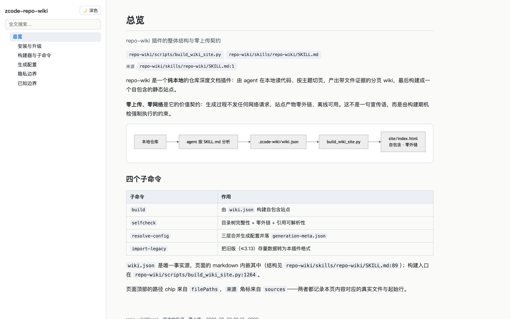
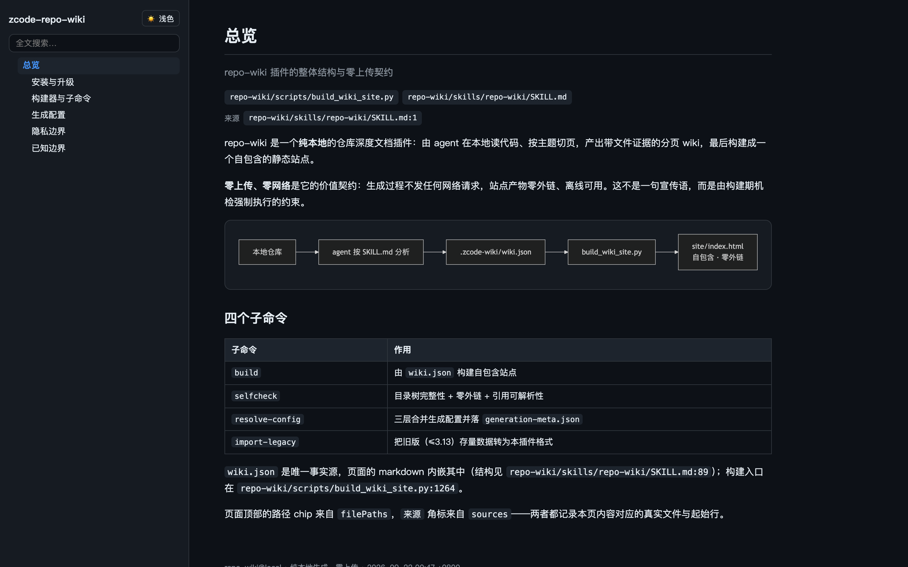
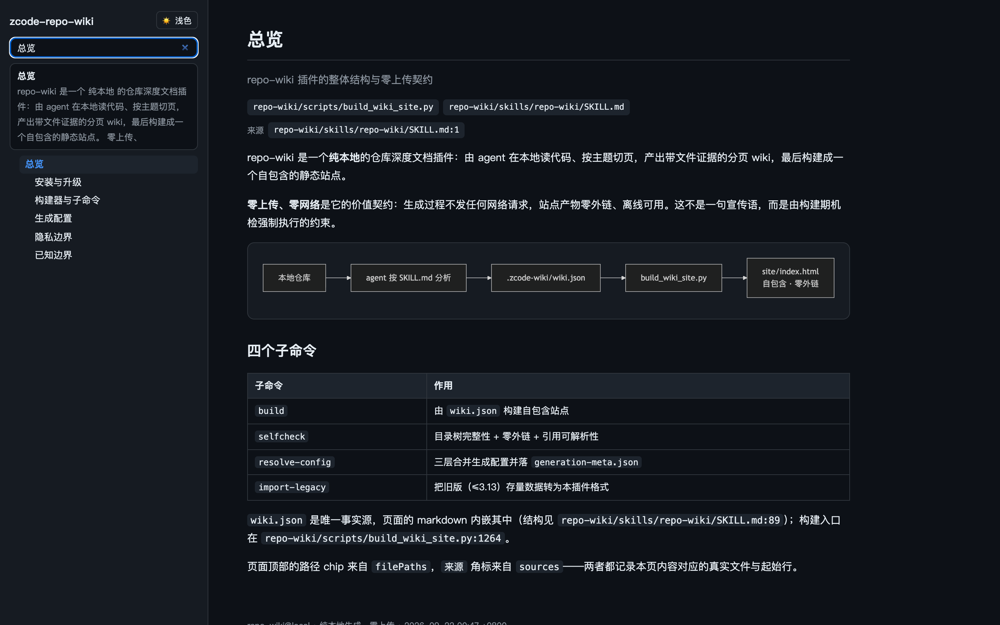
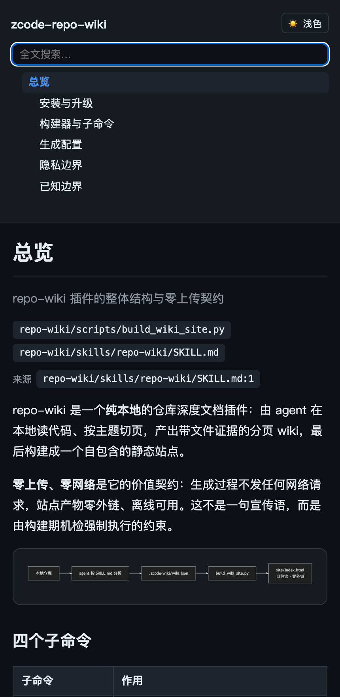

<div align="center">

  

  <h1>repo-wiki</h1>

  <p><strong>纯本地仓库 Wiki：零上传、零网络。</strong><br />
  由 agent 在本地读懂仓库，产出分页 wiki（目录树 + 图表 + 文件级证据），构建成单文件自包含站点。</p>

  <p><em>替代 ZCode 3.14.0 起被下架的官方 Repo Wiki 入口。</em></p>

  <p>
    <a href="repo-wiki/README.md">插件文档</a> ·
    <a href="#-安装">安装</a> ·
    <a href="#-用法">用法</a> ·
    <a href="#-效果">效果</a> ·
    <a href="#-隐私承诺">隐私承诺</a> ·
    <a href="CHANGELOG.md">更新日志</a>
  </p>

  <p><a href="README.en.md">English</a> · 简体中文</p>

  <br />

  <a href="https://github.com/Acfufu/zcode-repo-wiki/actions/workflows/test.yml"></a>

  <br />
</div>

> [!NOTE]
> **代码库的知识不该只活在原作者脑子里，也不该以"把整个仓库传上去"为代价。**
>
> repo-wiki 让 agent 在本地读代码、按主题切页，逐页写出**带文件路径与行号证据**的正文和图表，最后构建成一个可以直接双击打开的 HTML。没有 CDN、没有字体请求、没有遥测：图表的 mermaid 运行时整包内联，站点产物零外链——这不是约定，而是构建期机检强制执行的约束。
>
> ```bash
> git clone https://github.com/Acfufu/zcode-repo-wiki && cd zcode-repo-wiki && bash install.sh
> ```

## 🖼️ 效果

生成的站点是单文件自包含的：侧栏目录树、全文搜索、深浅双主题、窄屏自适应，全部离线可用。



<details>
<summary>深色主题 / 全文搜索 / 窄屏</summary>







</details>

上面的截图来自本仓库自带的演示样张 `docs/demo/`——它记录的正是这个仓库自己。不需要 agent 也能立刻看到效果：

```bash
python3 repo-wiki/scripts/build_wiki_site.py build --wiki docs/demo
open docs/demo/site/index.html        # Linux: xdg-open
```

## 🚀 安装

前置：ZCode 桌面端（已登录）、`python3`、`rsync`、`zip`。构建器纯 Python3 标准库（≥3.7），无第三方依赖。

```bash
git clone https://github.com/Acfufu/zcode-repo-wiki
cd zcode-repo-wiki
bash install.sh          # 同步到引擎插件缓存 → 注册 → 启用（可重复执行）
```

`install.sh` 把 `repo-wiki/` 同步到 `~/.zcode/cli/plugins/cache/local/repo-wiki/<版本>/`，在 `installed_plugins.json` 写入带 sha256 的 registry entry，并在 `setting.json` 的 `enabledPlugins` 中启用。三份配置先全部校验再统一 tmp + replace 落盘，不留半安装状态；新建配置文件用 `0600`。仓库根的 `<name>-<version>.zip` 仅在缺失或源较新时重建。

## 🧭 用法

会话内直接说需求，或使用命令：

```
/repo-wiki generate <仓库路径>       # 生成 wiki + 建站 + 自检
/repo-wiki import-legacy <hash>      # 导入旧版（≤3.13）存量数据
/repo-wiki view <wiki目录>           # 内容更新后重建站点
```

临时覆盖生成参数：`/repo-wiki generate <仓库路径> --set language=zh-CN --set profile=legacy`。

脚本直用（纯标准库，诊断走 stderr、数据走 stdout）：

```bash
python3 repo-wiki/scripts/build_wiki_site.py build          --wiki <仓库>/.zcode-wiki
python3 repo-wiki/scripts/build_wiki_site.py selfcheck      --wiki <仓库>/.zcode-wiki
python3 repo-wiki/scripts/build_wiki_site.py resolve-config --repo <仓库路径> [--set k=v …]
python3 repo-wiki/scripts/build_wiki_site.py import-legacy  <hash|绝对路径>
```

产物落在 `<仓库>/.zcode-wiki/`：`wiki.json`（唯一事实源）、`pages/<id>.md`（导出副本）、`generation-meta.json`（生效配置与 provenance）、`site/index.html`（自包含站点）。

## 🧩 能力

| 能力 | 说明 |
| --- | --- |
| 📄 **分页 wiki** | 目录树 + 每页 `description`/`filePaths`/来源角标；页数、页长、切分粒度（`theme`/`file`/`hybrid`）可配 |
| 🧭 **图表** | mermaid 代码块用内联运行时离线渲染；`diagrams=minimal/rich` 控制架构、数据流页的配图密度 |
| 🧾 **证据优先** | 正文里的论断带 `` `路径:行号` `` 引用，`selfcheck` 强制每条引用文件存在、行号在界内 |
| 🔍 **全文搜索** | 站点内建索引，命中项可键盘操作（Tab + Enter）；单页正文上限 2 万字符 |
| 🌗 **双主题** | 跟随系统 + 手动切换 + localStorage 持久化，脏值自动归一 |
| 📱 **窄屏自适应** | ≤760px 时侧栏堆叠到正文上方 |
| 🛡️ **净化与机检** | 直通 SVG 走 XML 解析器白名单重序列化；外链机检覆盖实体编码、protocol-relative、CSS `url()` 与 `@import` 等形态 |
| 🎛️ **生成配置** | 四层合并（内置 → 全局 → 仓库 → 旗标）+ 逐字段 provenance 留档；预设 `compact`/`standard`/`deep`/`legacy` |
| 📦 **存量导入** | 旧版 `~/.zcode/v2/repo-wiki/<hash>/` 一键转成本插件格式并建站 |

完整行为说明（净化细节、配置值域、已知边界）见 [`repo-wiki/README.md`](repo-wiki/README.md)；agent 侧的生成协议见 [`repo-wiki/skills/repo-wiki/SKILL.md`](repo-wiki/skills/repo-wiki/SKILL.md)。

## 🔒 隐私承诺

| 行为 | repo-wiki |
| --- | --- |
| 上传仓库内容 / Git 历史 | 从不 |
| 网络请求（生成、图表、字体、脚本） | 从不 |
| 读取 `.git` 对象内容 | 从不（唯一例外：可选的 `git log --oneline -15` 摘要命令） |
| 产物位置 | 仅本地磁盘 |

边界同样写清楚：外链机检是**有界启发式**（无法形式化证明"任何输入都不会产生外链"），插件约束的是产物形态而非 agent 行为。详见 [`SECURITY.md`](SECURITY.md)。

## 🧱 仓库结构

```
zcode-repo-wiki/
├── install.sh                      # 本地安装器：同步到引擎插件缓存并注册启用
├── repo-wiki/                      # 插件本体（local 市场分发的载荷）
│   ├── .zcode-plugin/plugin.json   # 插件清单（name/version/description/keywords）
│   ├── skills/repo-wiki/SKILL.md   # agent 生成协议：硬约束 + 5 个阶段
│   ├── commands/repo-wiki.md       # /repo-wiki 命令
│   ├── scripts/build_wiki_site.py  # 构建器：build / selfcheck / resolve-config / import-legacy
│   ├── assets/mermaid.min.js       # 离线图表运行时（第三方许可见 THIRD-PARTY-NOTICES）
│   └── tests/                      # 回归套件 + fixture 样本
├── docs/
│   ├── assets/                     # logo 与查看器截图
│   └── demo/                       # 演示样张（wiki.json；构建产物 site/ 不入库）
└── .github/workflows/test.yml      # 回归测试 + 样张自检
```

## 🧪 测试

```bash
python3 repo-wiki/tests/test_build_wiki_site.py     # 纯标准库，无需参数，不写仓库
```

覆盖 fixture 构建与自检、配置合并与校验边界、注入与净化（含 Chrome 级 PoC）、失败路径的干净报错与写入原子性、以及显示名回落；结尾打印 `N/N passed`。

CI（[`test.yml`](.github/workflows/test.yml)）在 Ubuntu（3.9/3.11/3.13）与 macOS（3.13）上运行，并额外做两件事：用 `node --check` 对站点内联脚本做**真实语法校验**（viewer 的搜索/主题/图表全在那段脚本里，子串断言抓不到语法错误），以及对演示样张做 `build + selfcheck`，确保引用行号不漂移。

## 📄 许可

MIT —— 见 [`LICENSE`](LICENSE)。`repo-wiki/` 目录另附同名许可随插件分发。

内联的 mermaid 运行时 bundle 含第三方组件（mermaid、DOMPurify 等）的许可声明，见 [`repo-wiki/assets/THIRD-PARTY-NOTICES`](repo-wiki/assets/THIRD-PARTY-NOTICES)。
